<div align="center">

<!-- BENTO GRID ARCHITECTURE HERO -->


<br/><br/>

<!-- ANIMATED TERMINAL TELEMETRY -->


<br/><br/>

### ─── [ SYSTEM_TELEMETRY // GITHUB_METRICS ] ───

<br/>


<br/>


<br/><br/>

### ─── [ COMM_CHANNELS // CONNECT ] ───

<br/>

<a href="mailto:sajalmishra0906@gmail.com"></a>
<a href="https://nomadicai.vercel.app"></a>
<a href="https://github.com/snipy09"></a>

<br/><br/>

```text
[PROCESS COMPLETED // EXIT 0x00] ──────────────────────────────────────────────
Session :: snipy09-core @ workstation [active] | 24/7 continuous ops
──────────────────────────────────────────────────────────────────────────────
```

</div>
