<div align="center">



<br/><br/>

<a href="https://github.com/snipy09">
  
</a>

<br/>


</div>

```text
┌─ SYS_TELEMETRY // NEOFETCH.SH ──────────────────────────────────────────────┐
│   .------------.  │ USER      :: Sajal Kumar Mishra (@snipy09)             │
│   | .--------. |  │ ROLE      :: Systems Architect & Full-Stack Engineer   │
│   | | >_ dev | |  │ FOCUS     :: High-Throughput Automation & SaaS         │
│   | | active | |  │ FLAGSHIP  :: Nomadic [Universal Career OS]             │
│   | '--------' |  │ DOMAINS   :: Full-Stack, DOM Automation, Desktop Apps  │
│   '------------'  │ UPTIME    :: 24/7 [Shipping resilient code]            │
│      /      \     │ PALETTE   :: Dark (#09090b) + Powder Blue (#bae2fd)    │
│     /________\    │ LOCATION  :: India (UTC+05:30)                         │
└────────────────────────────────────────────────────────────────────────────┘
```

```text
┌─ MODULES_LOADED // TECH_STACK ──────────────────────────────────────────────┐
│ LANGUAGES   :: TypeScript, JavaScript, Python 3.11, SQL, HTML5/CSS3        │
│ FRONTEND    :: React 18, Next.js, TailwindCSS, Vite, Zustand, Radix UI     │
│ BACKEND     :: Node.js, Express, FastAPI, RESTful APIs, WebSockets         │
│ DESKTOP/APP :: Electron, Windows Authenticode, Chrome DevTools Protocol    │
│ DATABASE    :: PostgreSQL, Supabase (RLS & Realtime), Redis, Prisma        │
│ INFRA/TOOLS :: Git/GitHub, Docker, Vercel, Turborepo, Bash, Linux          │
└────────────────────────────────────────────────────────────────────────────┘
```

```text
┌─ COMPUTE_METRICS // PROFICIENCY_INDEX ──────────────────────────────────────┐
│ Frontend & UI Systems     [████████████████████░░░░] 85%                   │
│ Full-Stack & API Design   [██████████████████████░░] 92%                   │
│ DOM & Form Automation     [████████████████████████] 98%                   │
│ Desktop & Native Run      [██████████████████░░░░░░] 78%                   │
│ Database & Schema Design  [████████████████████░░░░] 84%                   │
│ Deterministic CI/CD       [████████████████████░░░░] 86%                   │
└────────────────────────────────────────────────────────────────────────────┘
```

```text
┌─ OPERATIONAL_BUILDS // REPOSITORIES ────────────────────────────────────────┐
│ 01. NOMADIC // Universal Career OS                                         │
│     ├── Deployment : https://nomadicai.vercel.app                          │
│     ├── Stack      : React 18, Supabase RLS, Electron Desktop (Signed)     │
│     ├── Core Engine: OmniForm DOM Solver (>95% accuracy) & AI Pilot        │
│     └── Features   : Sub-30ms pagination, 428+ Question Bank, Tier sync    │
│                                                                            │
│ 02. DCUBOID CRM // Enterprise Sales & Operations Cockpit                   │
│     ├── Target     : Pipeline telemetry & high-efficiency execution        │
│     └── Stack      : 3-column cockpit, dark telemetry, low-latency sync    │
│                                                                            │
│ 03. HIGH-THROUGHPUT AUTOMATION HARNESSES                                   │
│     ├── Targets    : Ashby, Greenhouse, Lever, Internshala scrapers        │
│     └── Mechanics  : Prototype setter injection & CDP session hooks        │
└────────────────────────────────────────────────────────────────────────────┘
```

```text
┌─ SYSTEM_ARCHITECTURE // CORE_PARADIGMS ─────────────────────────────────────┐
│ [01] DETERMINISTIC AUTOMATION :: End-to-end perception loops with fallback │
│                                  arbitration and zero hardcoded fragility. │
│ [02] RESILIENT CLIENT STATE  :: Sub-30ms query budgets, optimized local    │
│                                  caching, and instant optimistic UI sync.  │
│ [03] MONOTONE DESIGN LOGIC   :: High-contrast, zero-noise dark interfaces  │
│                                  with subtle powder-blue accents only.     │
│ [04] SYSTEM INTEGRITY        :: Strict RLS policies, Authenticode signing, │
│                                  and robust server-side tier validation.   │
└────────────────────────────────────────────────────────────────────────────┘
```

<div align="center">

### ─── [ SYSTEM_TELEMETRY // GITHUB_METRICS ] ───

<br/>


<br/>


</div>

```text
┌─ COMM_CHANNELS // CONNECT ──────────────────────────────────────────────────┐
│ PING PROTOCOLS ::                                                          │
│   EMAIL    -> sajalmishra0906@gmail.com                                    │
│   GITHUB   -> https://github.com/snipy09                                   │
│   LINKEDIN -> https://linkedin.com/in/sajal-mishra                         │
│   LIVE APP -> https://nomadicai.vercel.app                                 │
│                                                                            │
│ TERMINAL INVOCATIONS ::                                                    │
│   $ git clone https://github.com/snipy09/<repository>.git                  │
│   $ curl -sL https://api.github.com/users/snipy09 | jq '.public_repos'     │
└────────────────────────────────────────────────────────────────────────────┘
```

```text
┌─ PROCESS_TERMINATION // EXIT 0 ─────────────────────────────────────────────┐
│ Status  :: Process completed with exit code 0x00 [OK]                      │
│ Session :: snipy09-core @ workstation [active]                             │
│ Keymap  :: [Ctrl+C] to interrupt | [Enter] to execute                      │
│ Hash    :: 0x8F3C...A4B1                                                   │
└────────────────────────────────────────────────────────────────────────────┘
```
