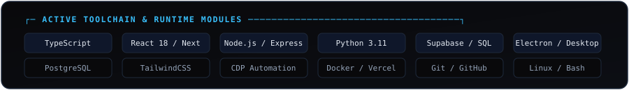

<div align="center">

<!-- HERO ANIMATED ASCII BANNER -->


<br/><br/>

<!-- DYNAMIC TYPING TELEMETRY -->
<a href="https://github.com/snipy09">
  
</a>

<br/>

<!-- SYSTEM VELOCITY & EXECUTION GRAPH -->


<br/><br/>

<!-- ACTIVE TOOLCHAIN & RUNTIME MODULES -->


</div>

<br/>

### ─── [ FEATURED_DEPLOYMENTS // REPOSITORIES ] ───

| Repository | Focus & Architecture | Status |
| :--- | :--- | :--- |
| **[nomadic](https://github.com/snipy09/nomadic)** | **Universal Career OS**<br/>• React 18, Supabase RLS, Electron Desktop App<br/>• OmniForm DOM Solver with prototype setters (&gt;95% accuracy)<br/>• Sub-30ms client query state pagination & tier enforcement | `PRODUCTION ALPHA` |
| **omniform-engine** | **Autonomous Form Solver & Perception Loop**<br/>• Multi-pass React 18 prototype setter injection & deep DOM arbitration<br/>• Specialized automation for Ashby, Greenhouse, Lever, Internshala | `ONLINE` |
| **automation-harnesses** | **High-Throughput Scrapers & Toolchain**<br/>• Resilient background scrapers, CDP browser hooks, desktop packaging<br/>• Low-latency cache normalization & deterministic pipelines | `CONTINUOUS` |

<br/>

<div align="center">

### ─── [ SYSTEM_TELEMETRY // GITHUB_METRICS ] ───

<br/>


<br/>


<br/><br/>

### ─── [ COMM_CHANNELS // CONNECT ] ───

<br/>

<a href="mailto:sajalmishra0906@gmail.com"></a>
<a href="https://nomadicai.vercel.app"></a>
<a href="https://github.com/snipy09"></a>

<br/><br/>

```text
[PROCESS COMPLETED // EXIT 0x00] ──────────────────────────────────────────────
Session :: snipy09-core @ workstation [active] | 24/7 continuous ops
──────────────────────────────────────────────────────────────────────────────
```

</div>
